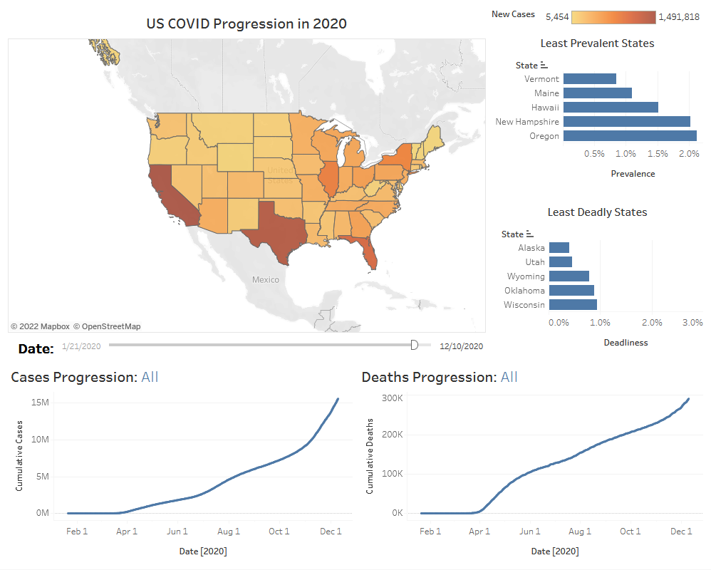

# Start

This document summarizes the thought process and details of creating a Tableau Dashboard (snapshot below) for visualizing US COVID statistics during the 2020 calendar year.

### The general process was as follows:
1. [Decide on Objective](#DecideOnObjective)
0. [Prepare Data](#PrepareData)
0. [Create Dashboard]()

# Decide on Objective:

Before we even start looking at data or opening our dashboard creation software, we need to have a clear question or objective in mind that we are trying to address. For this project, I decided to focus on answering the general question of **"how did COVID unfold in the United States in 2020?".**

## Target Audience: 
As import as knowing what question you're trying to answer is knowing *who* you're trying to answer it for. I decided that my target audience would be someone working for the CDC who was charged with examining how the pandemic progressed, and what future strategies could be learned from looking back. Knowing the target audience shapes what kind of information you want to present and at what level of depth. 

For example: a doctor or nurse might be more concerned with the immediate problem. After all, they have patients to attend to now - and knowing what the current case load is has a direct effect on their daily routine. A member of the CDC however would be less concerned of the immediate discrete case load and more likely to focus on what the peaks and troughs were over a span of months. Logistics and planning are their wheelhouse, and the big picture is more important to them.

These notions of what my audience expects to get out of my presentation will define what data we show, and in what manner. Knowing these questions before we start messing with data and dashboards can save us time and prevent us from spinning our wheels while neck deep in numbers.

## Adding Scoped Questions:
Within this broad question, there were several smaller scoped questions that would help narrow our focus and let us answer the big picture question.

### **How did COVID unfold in the US in 2020?**
1. **How did the number of cases change in the course of a year?**
   * Peak loads or troughs could be linked to holidays, travel spikes, or other factors that could help limit the spread of a disease in the future.
0. **How did individual states compare in total cases?**
   * If a state stood out in either a positive or negative way, it could be examined more closely to see if any unusal strategies were adopted that could benefit other states later on.
0. **Was there a difference between deadliness and number of cases (prevalence)?**
   * A disease is deadly if a high percentage of infected people die. It is prevalent if a large number of people get infected. If a state managed to keep deaths to a minimum despite a large number of cases, their course of action could be useful to other states for the next pandemic. After accounting for the inherent deadliness of the disease itself, there could be other factors that determined a patients survival, such as the number of total available ICU beds.

Having these questions clearly defined, we are ready to preprocess our data.

# Prepare Data:

# Notes: 

Before I started playing with data, I start with these questions:
1. How are states handling COVID?
   * Which states are doing well/poorly?
   * How are case numbers changing?
0. Who am I designing this dashboard for?
   * Data science professionals?
      * More aware of what metrics are important
   * Average American?

## Important Data Metrics:
* Total number of cases.
   * Case count / state population.
      * Lets you know state efficiency at handling COVID.
   * Case count 

## Average American:
* How bad is it now?
   * Total number of cases.
* How bad will it be?
   * Case count acceleration?
   * Boolean "Getting Better" or "Getting Worse".
   * Weekly percent change ?

## Data Scientist:
* How bad is it now?
* How bad will it be?
   * Case 

# Design:
* Map of US that has buttons to show: Cases, Deaths, Deadliness.
* Play button to show progression over time.
* Data box to show 

# Level 1 User:
* How bad was COVID?
* Animation of elapsing time.
   * Fast timeline of play.
* Ticker for Total Cases, Deaths, and Deadliness (Deaths/Cases)
   * Pie Chart for visually showing the same thing?
      * This gives an instant "proportions viewpoint" for a non-numbers person.
      * Redundant information helps drive home point.
* Minimizes number of interactive options or slicers that they can touch.
* Map graphic because maps are cool and recognizable.

# Holistic View of how COVID progressed: 
* Focus is on the timeline: How did COVID unfold in 2020.
* Target audience is CDC looking back on how they did for 2020.
   * Useful for estimating peak load (on hospitals) during a pandemic.
   * Percentage of infected population could provide insight into why it was low/high.
* This means:
   * Cumulative case load (as opposed to new cases per day).
   * Time series data (as opposed to just a bar graph) - likely a line chart.
* Figure out if there were specific events that caused higher than normal spikes.

## Takeaway:
* Here are the states that did well in Prevalence, Deadliness.

# Things I did:
* Plan out the scope of what I was trying to show (target audience).
   * Information that I would want to see that I hadnt before.
* Spent a lot of time in the data before ever reaching Tableau.
   * Derived new fields for new cases/deaths from cumulative numbers.
   * Noticed that sometimes the number of deaths decreased...
      * This could be a misreport, or a data error.
      * Corrected this to zero for the purpose of the excercise.